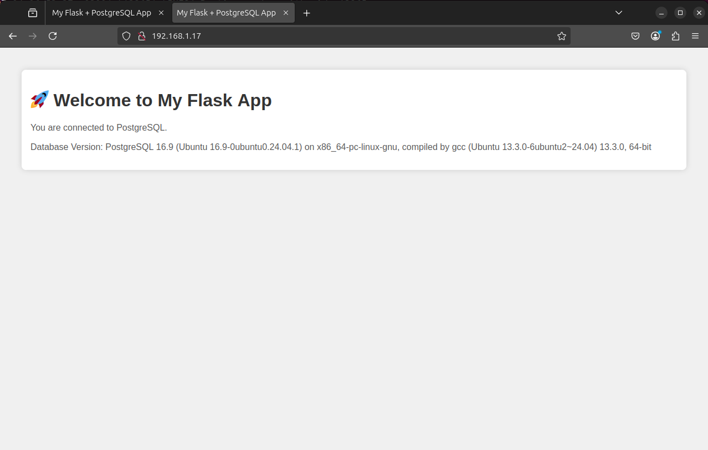

# Flask + PostgreSQL + Nginx Automation

This project demonstrates a complete end-to-end deployment of a Flask web application running behind Gunicorn and Nginx, connected to a PostgreSQL database.

It was created as part of my DevOps learning journey to understand how modern web applications are deployed and served in a production-like environment.

---

## 🚀 Quick Start

### 1️⃣ Clone the Repository

```bash
git clone https://github.com/adaamk/flask-postgres-nginx-automation.git
cd flask-postgres-nginx-automation
```

---

### 2️⃣ Create Virtual Environment & Install Dependencies

```bash
python3 -m venv venv
source venv/bin/activate
pip install -r requirements.txt
```

---

### 3️⃣ Configure PostgreSQL

Create a PostgreSQL user and database:

```bash
sudo -u postgres psql
```

Inside the `psql` prompt:

```sql
CREATE DATABASE flaskdb;
CREATE USER flaskuser WITH PASSWORD 'yourpassword';
GRANT ALL PRIVILEGES ON DATABASE flaskdb TO flaskuser;
\q
```

Make sure your `app.py` is updated with your credentials if you chose a different username/password.

---

### 4️⃣ Run the Application Locally with Gunicorn

```bash
source venv/bin/activate
gunicorn --bind 127.0.0.1:8000 app:app
```

Visit:
[http://127.0.0.1:8000](http://127.0.0.1:8000)

---

### 5️⃣ Configure Nginx as a Reverse Proxy

Create a configuration file (e.g., `/etc/nginx/sites-available/flask_app`):

```
server {
    listen 80;
    server_name _;

    location / {
        proxy_pass http://127.0.0.1:8000;
        proxy_set_header Host $host;
        proxy_set_header X-Real-IP $remote_addr;
        proxy_set_header X-Forwarded-For $proxy_add_x_forwarded_for;
        proxy_set_header X-Forwarded-Proto $scheme;
    }
}
```

Enable the config and reload Nginx:

```bash
sudo ln -s /etc/nginx/sites-available/flask_app /etc/nginx/sites-enabled/
sudo nginx -t
sudo systemctl reload nginx
```

Visit:
```
http://<your_vm_ip>/
```

✅ You should see your Flask app served through Nginx.

---

## 🛠️ Project Structure

```
.
├── app.py             # Flask application
├── requirements.txt   # Python dependencies
├── setup.sh           # Optional setup script
├── .gitignore
└── README.md
```

---

## 🖼️ Screenshot

*Here you can add a screenshot of the app running.*

Example Markdown to embed it:

```markdown

```

---

## 📌 What I Learned

- Setting up and configuring PostgreSQL
- Creating and activating Python virtual environments
- Managing dependencies with `requirements.txt`
- Running Gunicorn as a WSGI server
- Using Nginx as a reverse proxy to serve Flask
- Basic Linux system administration

---

## ✨ Future Improvements

- Add HTML templates and static files
- Use Docker for containerized deployment
- Configure Gunicorn to run as a Systemd service
- Enable HTTPS with Let’s Encrypt

---

## 📄 License

This project is for educational purposes as part of my DevOps learning journey.

